# Now in Android - Technical Architecture Overview

## Executive Summary

**Now in Android** is a production-grade Android application demonstrating Google's recommended architecture patterns. The application follows an offline-first, reactive architecture built on modern Android technologies including Jetpack Compose, Room, Retrofit, Hilt, and WorkManager.

**Primary Function**: Deliver curated Android development news and articles to users, enabling them to follow topics of interest and bookmark content.

**Architecture Pattern**: Clean Architecture with MVVM, Unidirectional Data Flow (UDF), and Repository Pattern

---

## System Architecture Overview

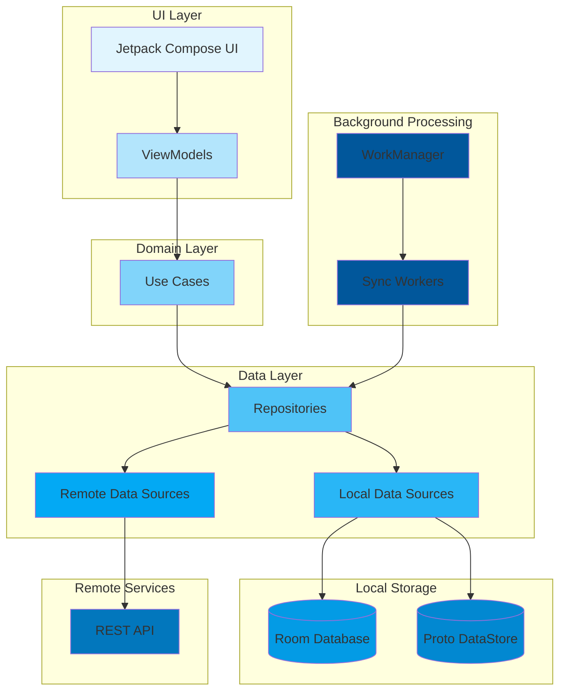

---

## Layer-by-Layer Architecture

### 1. UI Layer (Presentation)

**Technology Stack**: Jetpack Compose, Material 3, Navigation Compose

**Components**:
- **Composable Functions**: Declarative UI components
- **ViewModels**: State holders exposing UI state streams
- **UI State Models**: Immutable data classes representing screen state

**Responsibilities**:
- Render UI based on state
- Capture user interactions
- Navigate between screens
- Handle configuration changes

**Key Patterns**:
- Unidirectional Data Flow (UDF)
- State hoisting
- Single Activity architecture

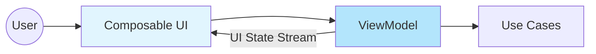

### 2. Domain Layer (Business Logic)

**Technology Stack**: Kotlin Coroutines, Flow

**Components**:
- **Use Cases**: Single-responsibility business logic operations

**Example Use Cases**:
- `GetFollowableTopicsUseCase`: Combines topic data with user follow status
- `GetUserNewsResourcesUseCase`: Merges news resources with user bookmark/view state
- `GetSearchContentsUseCase`: Provides search functionality

**Responsibilities**:
- Combine data from multiple repositories
- Transform data for UI consumption
- Implement complex business rules

**Pattern**: Each use case has a single `invoke()` operator function

### 3. Data Layer (Data Management)

**Technology Stack**: Room, Proto DataStore, Retrofit, OkHttp

**Components**:

#### 3.1 Repositories (Interfaces)

- **NewsRepository**: Manages news resource data
- **TopicsRepository**: Manages topic data
- **UserDataRepository**: Manages user preferences and state
- **SearchContentsRepository**: Manages search functionality
- **RecentSearchRepository**: Manages search history

#### 3.2 Repository Implementations

All repositories follow the **Offline-First** pattern:

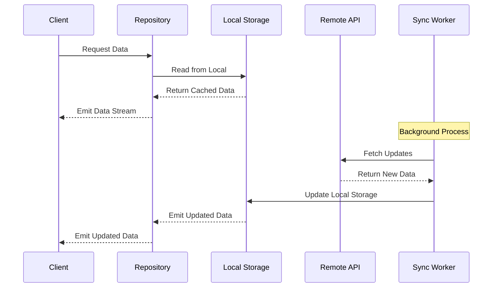

**Key Principles**:
1. **Single Source of Truth**: Local database is the source of truth
2. **Reactive Streams**: Data exposed as Kotlin Flows
3. **Background Sync**: WorkManager handles periodic synchronization
4. **Error Resilience**: Exponential backoff for sync failures

#### 3.3 Data Sources

**Local Data Sources**:

| Data Source | Technology | Purpose |
|-------------|-----------|---------|
| `NiaDatabase` | Room (SQLite) | Relational data (news, topics) |
| `NiaPreferencesDataSource` | Proto DataStore | User preferences and state |
| Full-Text Search | Room FTS | Search functionality |

**Remote Data Sources**:

| Data Source | Technology | Purpose |
|-------------|-----------|---------|
| `NiaNetworkDataSource` | Retrofit + OkHttp | REST API client |
| Network API | JSON over HTTPS | News and topic content |

---

## Data Model Architecture

### Core Entities

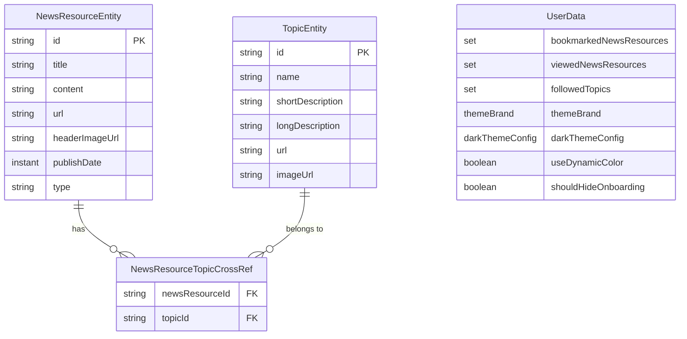

### Entity Relationships

**Many-to-Many Relationship**:
- NewsResource ↔ Topic (via NewsResourceTopicCrossRef)
- Foreign key constraints with CASCADE delete

**User State** (Proto DataStore):
- Bookmarked news resource IDs
- Viewed news resource IDs
- Followed topic IDs
- UI preferences (theme, dark mode, etc.)

---

## Data Flow Architecture

### Read Operation Flow

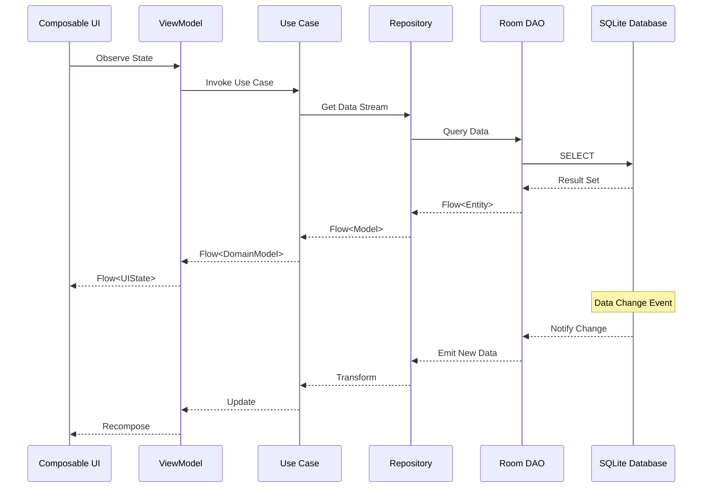

### Write Operation Flow

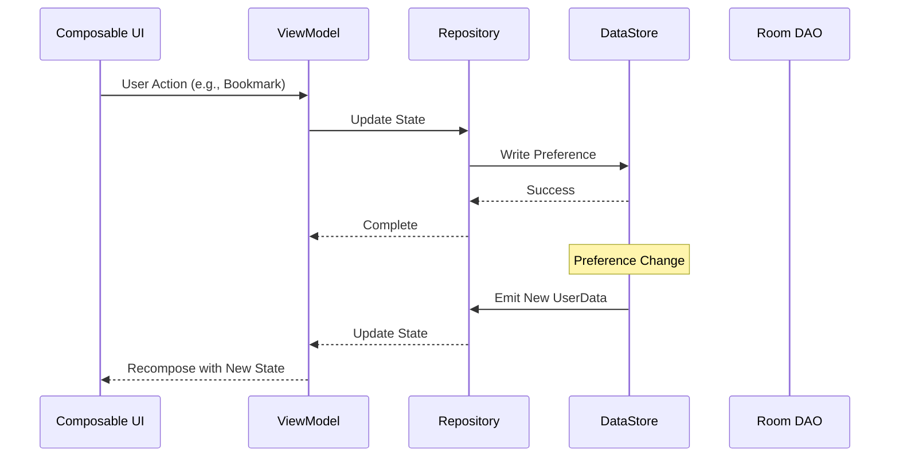

### Synchronization Flow

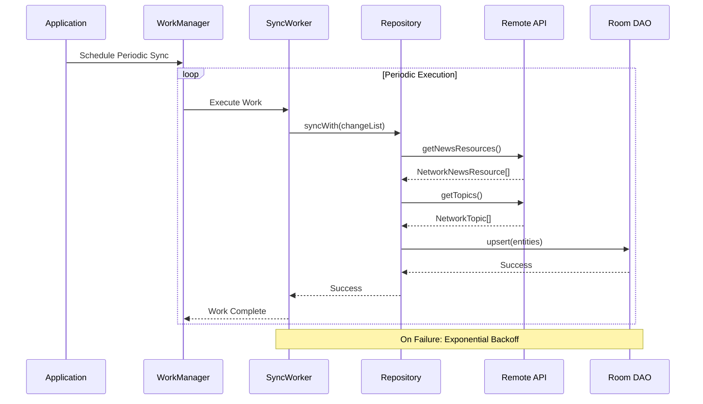

---

## Module Architecture

### Module Dependency Graph

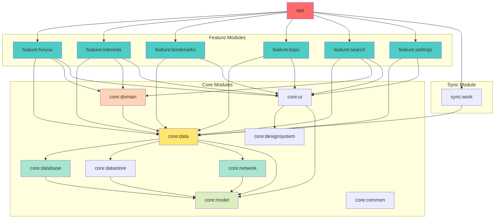

**Module Types**:
1. **App Module**: Main application module with dependency injection setup
2. **Feature Modules**: Self-contained UI features with navigation
3. **Core Modules**: Shared business logic, data access, and UI components
4. **Sync Module**: Background synchronization workers

---

## Integration Architecture

### External API Integration

**API Specification**:
- **Protocol**: REST over HTTPS
- **Format**: JSON
- **Authentication**: None (public API)

**Endpoints**:

| Endpoint | Method | Purpose | Response |
|----------|--------|---------|----------|
| `/topics` | GET | Retrieve topics | `List<NetworkTopic>` |
| `/newsresources` | GET | Retrieve news | `List<NetworkNewsResource>` |
| `/changelists/topics` | GET | Get topic changes | `List<NetworkChangeList>` |
| `/changelists/newsresources` | GET | Get news changes | `List<NetworkChangeList>` |

**Network Model Transformation**:

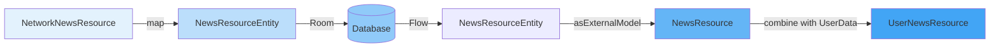

### Build Variants & Product Flavors

**Build Types**:
- `debug`: Development builds with logging
- `release`: Optimized production builds
- `benchmark`: Performance testing builds

**Product Flavors**:
- `demo`: Uses local static data (no backend required)
- `prod`: Connects to production backend API

**Active Configurations**:
- `demoDebug`: Primary development configuration
- `demoRelease`: Performance testing
- `prodRelease`: Production builds (published to Play Store)

---

## Dependency Injection Architecture

**Framework**: Hilt (Dagger-based)

**Injection Scopes**:

| Scope | Lifecycle | Purpose |
|-------|-----------|---------|
| `@Singleton` | Application | App-wide single instances |
| `@ActivityRetainedScoped` | Activity (survives config changes) | ViewModels |
| `@ActivityScoped` | Activity | Activity-specific dependencies |

**Key Modules**:

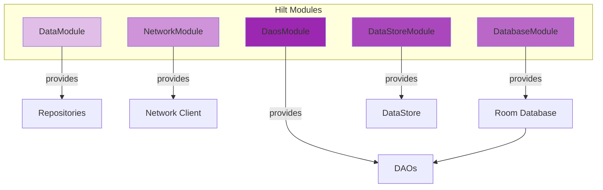

---

## State Management Architecture

### UI State Pattern

**State Container**: ViewModel

**State Representation**: Sealed interfaces/classes

**Example**:

```kotlin
sealed interface NewsFeedUiState {
    data object Loading : NewsFeedUiState
    data class Success(val feed: List<UserNewsResource>) : NewsFeedUiState
}
```

**Benefits**:
- Exhaustive when expressions
- Type-safe state handling
- Clear loading/success/error states

### State Transformation

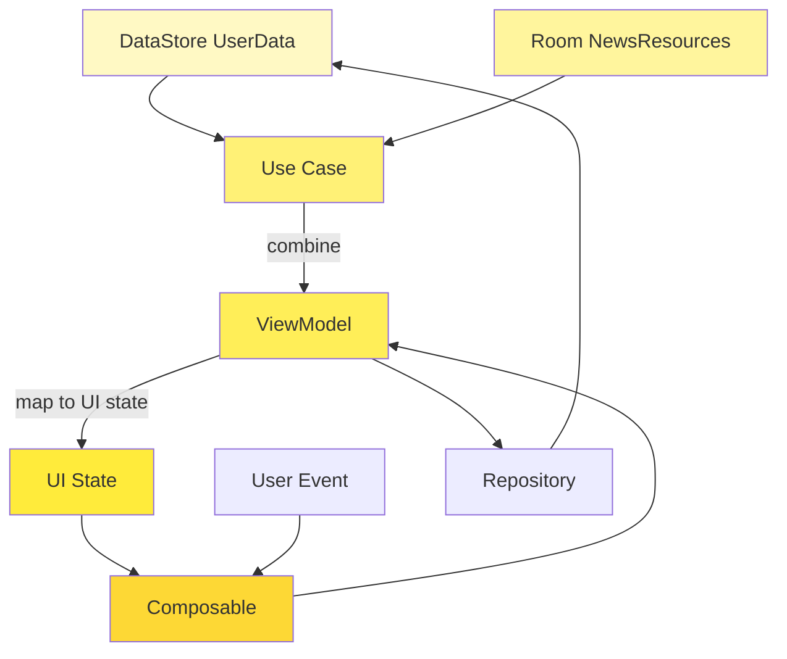

---

## Background Processing Architecture

**Framework**: WorkManager

**Worker Types**:
1. **SyncWorker**: Periodic data synchronization
2. **DelegatingWorker**: Delegates to other workers dynamically

**Sync Strategy**:

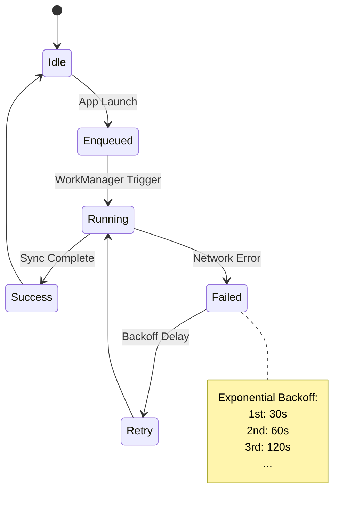

**Constraints**:
- Network connectivity required
- Battery not low (optional)
- Device idle (optional for non-urgent sync)

---

## Testing Architecture

### Test Doubles Strategy

**Philosophy**: No mocking frameworks

**Approach**: Test implementations of interfaces

**Test Repository Pattern**:

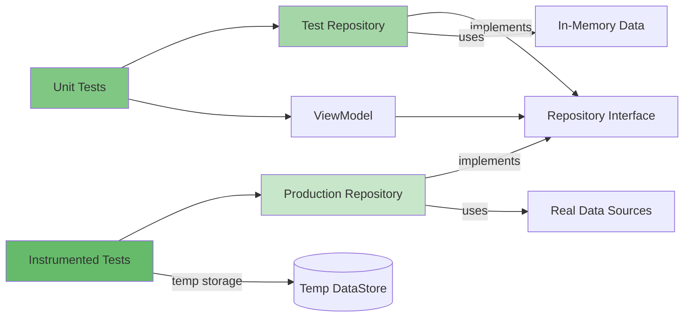

**Test Types**:

| Test Type | Framework | Scope |
|-----------|-----------|-------|
| Unit Tests | JUnit + Truth + Turbine | ViewModels, Use Cases, Repositories |
| Screenshot Tests | Roborazzi | UI Components |
| Instrumented Tests | AndroidX Test | Full app integration |
| Benchmark Tests | Macrobenchmark | Performance |

---

## Security & Privacy

**Authentication**: Not required (public content)

**Data Protection**:
- User preferences stored locally (Proto DataStore)
- No sensitive data transmitted
- HTTPS for all network calls

**Privacy**:
- No user tracking
- No analytics in demo flavor
- Firebase analytics in prod flavor (opt-in)

---

## Performance Optimizations

### Baseline Profiles
- AOT compilation for critical paths
- Reduced app startup time
- Stored in `app/src/main/baseline-prof.txt`

### Lazy Loading
- Paging for large lists
- Lazy column/grid composables
- On-demand image loading (Coil)

### Database Optimization
- Indexed columns for fast queries
- Full-Text Search for search functionality
- Foreign key constraints for referential integrity

### Network Optimization
- Response caching (OkHttp)
- Conditional requests (ETags)
- Change lists to minimize data transfer

---

## Summary of Architectural Characteristics

| Characteristic | Implementation |
|----------------|----------------|
| **Scalability** | Modular architecture enables parallel development |
| **Maintainability** | Clear separation of concerns across layers |
| **Testability** | Dependency injection + test doubles |
| **Reliability** | Offline-first ensures app works without network |
| **Performance** | Baseline profiles, lazy loading, efficient queries |
| **Security** | HTTPS, local data storage, no sensitive data |
| **Extensibility** | Plugin-based feature modules |
| **Observability** | Structured logging, Firebase analytics (prod) |

---

## Technology Stack Summary

| Layer | Technologies |
|-------|-------------|
| **UI** | Jetpack Compose, Material 3, Navigation Compose, Coil |
| **State Management** | ViewModel, Kotlin Flow, Coroutines |
| **Dependency Injection** | Hilt (Dagger) |
| **Data Persistence** | Room (SQLite), Proto DataStore |
| **Networking** | Retrofit, OkHttp, Kotlin Serialization |
| **Background Processing** | WorkManager |
| **Testing** | JUnit, Truth, Turbine, AndroidX Test, Roborazzi |
| **Build System** | Gradle (Kotlin DSL), Convention Plugins |
| **Performance** | Baseline Profiles, Macrobenchmark |

---

## Key Design Decisions

1. **Offline-First**: Local database is source of truth
   - **Rationale**: Better UX, works without network, reduces latency

2. **Reactive Streams (Flow)**: Data exposed as Kotlin Flows
   - **Rationale**: Automatic UI updates, reactive programming model

3. **Unidirectional Data Flow**: Events down, data up
   - **Rationale**: Predictable state management, easier debugging

4. **Single Activity**: One activity with Compose navigation
   - **Rationale**: Simplified navigation, better transitions, modern pattern

5. **Modularization**: Feature-based and layer-based modules
   - **Rationale**: Parallel development, build time optimization, clear boundaries

6. **No Mocking in Tests**: Test doubles instead of mocks
   - **Rationale**: More realistic tests, less brittle, exercises production code

7. **Proto DataStore**: Structured preferences storage
   - **Rationale**: Type-safe, efficient, supports migrations

---

*This document provides a comprehensive technical overview of the Now in Android application architecture. For formal specifications of the system behavior, see the accompanying Z++ specification files.*
